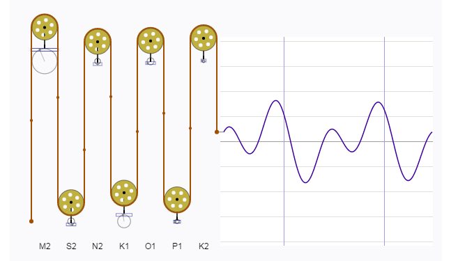
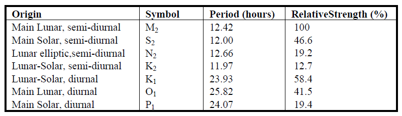

```{r setup, include=FALSE}
knitr::opts_chunk$set(echo = TRUE)
```

Water movement in estuaries is affected by many processes acting across space and time.  Tidal exchange with the ocean is an important hydrodynamic process that can define several characteristics of an estuary.  Physical flushing rates and water circulation are often controlled by tidal advection, whereas chemical and biological components are affected by the flux of dissolved or particulate components with changes in the tide.  As such, describing patterns of tidal variation is useful for characterizing many estuarine processes.  

Tidal predictions are nothing new.  A clever analog approach has been around since the late 1800s.  The [tide-predicting maching](https://en.wikipedia.org/wiki/Tide-predicting_machine) represents the tide as the summation of harmonics with different periods and amplitudes.  Think of a continuous line plot where the repeating pattern is linked to a rotating circle,  Representing the line in two-dimensions from the roating circle creates a sine wave.  We can create the same plot by adding the output of two or more rotating circles, where each circle can vary in its diameter and rate of rotation.  This is directly analogous to adding sine waves with different amplitudes (height) and periods (distance between peaks).  The tide-predicting machine is nothing more than a set of rotating circles linked to a single graph as the sum of the rotations from all circles. Here's a fantastic [digital representation](http://www.ams.org/samplings/feature-column/fcarc-tidesiii3) of the tide-predicting machine:



Tides are caused primarily by the gravitational pull of the sun and moon on the earth's surface.  The elliptical orbits of both the moon around the earth and the earth around the sun produce periodic but unequal forces that influence water movement.  These forces combined with local surface topography and large-scale circulation patterns from uneven heating of the earth's surface lead to the variation of tidal patterns across the globe.  Although complex, these periodic patterns can be characterized as the summation of sine waves.  This was the objecive of the earlier tide-predicting machines.  Fortunately for us, modern software (i.e., R) provides us with a simpler and less expensive approach based on harmonic regression.  

We'll create our own sine waves and add them up to demonstrate complexity from addition.  A simple way to do this in R is use the form:

$$
y = \alpha + \beta\sin\left(2\pi f x + \Phi\right)
$$
where the amplitude of the wave is $\beta$ and the frequency (or 1 / period) is $f$. The parameters $\alpha$ and $\Phi$ represent scalar shifts in the curve up/down and left/right, respectively. Multiple sine waves can be created using a function. This function takes the parameters from the above equation as arguments and returns a sine wave equal in length to the input time series.  The $\alpha$ and $\beta$ are interpreted as units of wave height (e.g., m) and $\f$ and \$Phi$ are in hours.  The default argumetns will return a sine wave with an amplitude of one and frequency of one wave per 24 hours.  Two additional time series are created that vary these two parameters.
```{r}

# input time series for two weeks, 15 minute time step
x <- as.POSIXct(c('2017-04-01', '2017-04-15'))
x <- seq(x[1], x[2], by = 60 * 15)

# function for creating sine wave
waves <- function(time_in, alpha = 0, beta = 1, freq = 24, phi = 0){

  # timestep per hour
  time_step <- 60 / unique(diff(time_in))
  
  # set phi as difference in hours from start of time_in
  phi  <- min(time_in) + phi * 3600
  phi<- as.numeric(difftime(phi, min(time_in)))
  phi <- phi / time_step
  
  # get input values to cos func
	in_vals <- seq(0, length(time_in), length = length(time_in))
	in_vals <- in_vals / time_step
  in_vals <- 2 * pi * in_vals * 1 / freq

  # wave
	y <- alpha + beta * sin(in_vals + phi)
	
	return(y)
	
	}

# get three sine waves
# a: default
# b: amplitude 0.5, 48 hour period
# c: amplitude 2, 12 hour period
a <- waves(x)
b <- waves(x, beta = 0.5, f = 48)
c <- waves(x, beta = 2, f = 12)
```

We can combine all three waves in the same data object, take the summation, and plot to see how it looks.
```{r, message = F, fig.height = 7, fig.width = 7}
library(tidyverse)

# get sum of all y values, combine to single object
yall <- rowSums(cbind(a, b, c))
dat <- data.frame(x, a, b, c, yall) %>% 
  gather('var', 'val', -x)

# plot
ggplot(dat, aes(x = x, y = val)) + 
  geom_line() + 
  facet_wrap(~var, ncol = 1) + 
  theme_bw()
```

The important piece of information we get from the plot is that adding simple sine waves can create complex patterns. About 83% of the variation in tides is created by seven different harmonic components that, when combined, lead to the complex patterns we observe from monitoring data.  These components are described as being of lunar or solar original and relative periods occuring either once or twice daily.  The so-called 'M2' component is typically the dominant tidal wave caused by the moon, twice daily.  The periods of tidal components are constant across locations but the relative strength (amplitudes) vary considerably.



The [oce](https://cran.r-project.org/web/packages/oce/) package in R has a nifty function for predicting up to 69 different tidal constituents.  You'll typically only care about the main components above but it's useful to appreciate the variety of components included in a tidal signal.  We'll apply the tidem function from oce to predict the tidal components on a subset of SWMP data. A two-week period from the Apalachicola Bay Dry Bar station is used.

```{r, message = F, warning = F}
library(SWMPr)
library(oce)

# clean, one hour time step, subset, fill gaps
dat <- qaqc(apadbwq) %>% 
  setstep(timestep = 60) %>% 
  subset(., subset = c('2013-01-01 0:0', '2013-12-31 0:0'), select = 'depth') %>% 
  na.approx(maxgap = 1e6)
```

The tidem function from oce requires a 'sealevel' object as input. Plotting the sealevel object using the plot method from oce shows three panels; the first is the complete time series, second is the first month in the record, and third is a spectral decomposition of the tidal components as cycles per hour (cph, or period).  
```{r fig.height = 9, fig.width = 8, }
datsl <- as.sealevel(elevation = dat$depth, time = dat$datetimestamp)
plot(datsl)
```

We can estimate the components from the table above using tidem.  Here, we estimate each component separately to extract predictions for each, which we then sum to estimate the complete time series.    
```{r}
constituents <- c('M2', 'S2', 'N2', 'K2', 'K1', 'O1', 'P1')
preds <- sapply(constituents, function(x){
  
    mod <- tidem(t = datsl, constituent = x)
    alph <- mod@data$amplitude[1]
    predict(mod) - alph
    
  }) 

predall <- rowSums(preds) + mean(datsl[['elevation']])
preds <- data.frame(time = datsl[['time']], preds, predall) 

head(preds)
```

The fitted model object above returns the estimated parameters for each tidal component, where frequency is the period ($f$ in the above equation), amplitude ($\beta$), and phase ($\Phi$). The Z0 estimate is a constant equal to $\alpha$.  It's also important to remmber that this is a model and the 'misfit' should always be evaluated, represented by root mean square (RMS) in the output.  Although this is not an option from the oce package, we can use the output from the model to reconstruct the estimated tidal components.

```{r, fig.height = 10, fig.width = 8}

toplo <- preds %>% 
  gather('component', 'estimate', -time) %>% 
  mutate(component = factor(component, level = c('predall', constituents)))

ggplot(toplo, aes(x = time, y = estimate, group = component)) + 
  geom_line() + 
  scale_x_datetime(limits = as.POSIXct(c('2013-07-01', '2013-07-31'))) + 
  facet_wrap(~component, ncol = 1, scales = 'free_y') + 
  theme_bw() 

```


